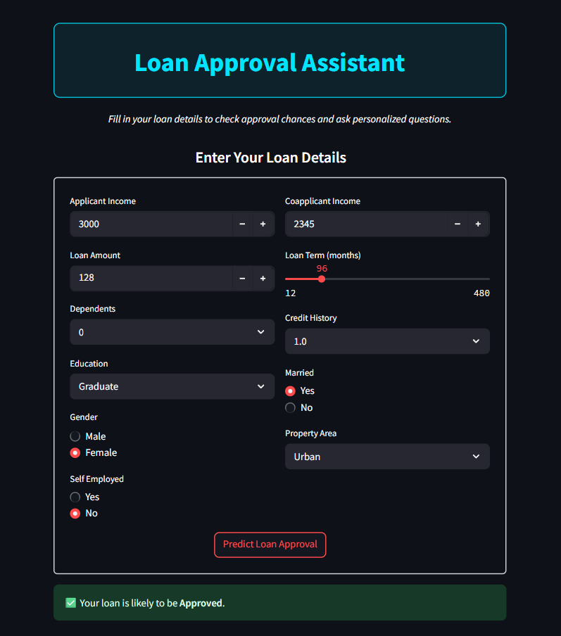
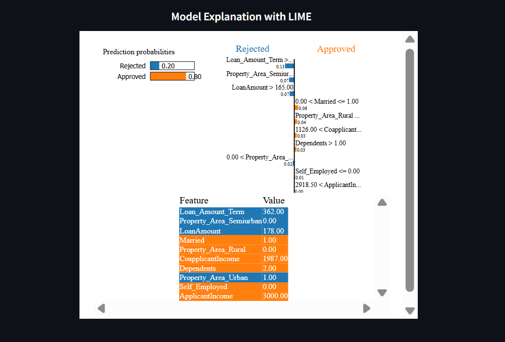
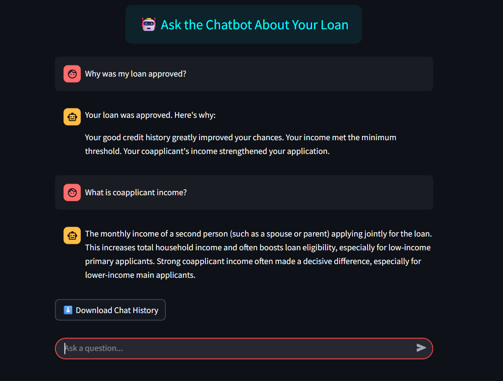

# 🏦 Loan Approval Assistant

An AI-powered Streamlit application that predicts loan approval based on user-provided financial and personal details. It combines a trained ML model with Retrieval-Augmented Generation (RAG) to offer personalized chatbot explanations for loan decisions.

---

## 🚀 Features

- 🤖 **Loan Chatbot Assistant** – Explains loan results using user profile + document knowledge base.
- 📈 **Prediction Model** – Based on trained loan approval dataset and classifier (supports LIME explanations).
- 🧠 **Feature Importance Insights** – Visual aid showing key factors affecting decisions.
- 🧾 **Interactive Two-Column Input UI** – Sleek design to collect user data (income, employment, property, etc.).
- 📘 **Sidebar Information Panel** – Explains the app, steps, and model usage.
- 📝 **Chat History Download** – Save assistant responses for later reference.

---

## 👁️ Preview

### > Input Form & Prediction Output

- Collects and verifies all required fields.
- Gives instant approval/rejection decision.
- Shows reasons based on model logic and rules.

### > LIME Model Explanation

- Visual HTML interface for feature contribution.

### > Loan Chatbot

- Answers: “Why was I rejected?” or “Why was I approved?”
- Personal and knowledge-based response generation.

---

## 🛠️ Tech Stack

- **Frontend:** Streamlit + HTML/CSS (Custom Styles)
- **ML Model:** Pre-trained model (via Joblib)
- **RAG System:** FAISS + Custom Prompting + Flan-T5 (via HuggingFace)
- **Visualization:** LIME, PNG-based feature graphs
- **Backend:** Python, Pandas, NumPy

---

## 🔧 Getting Started

### 1. Clone the Repository

```bash
git clone https://github.com/your-username/LoanApprovalAssistant.git
cd LoanApprovalAssistant
```

### 2. Install Requirements

```bash
pip install -r requirements.txt
```

Sample `requirements.txt`:

```txt
streamlit
pandas
numpy
joblib
scikit-learn
lime
faiss-cpu
transformers
sentence-transformers
```

### 3. Run the App

```bash
streamlit run app.py
```

---

## 📌 Notes

- Ensure your `loan_model.pkl`, `X_train.csv`, and document chunks are in the project directory.
- This app is for educational and financial literacy purposes.
- Not intended as actual loan advice – predictions depend on dataset quality and model accuracy.

---
## 🌐 Live Demo

Check out the Live App : https://loanassistant-07.streamlit.app/

---
